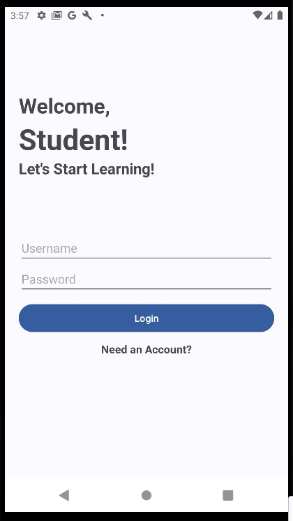
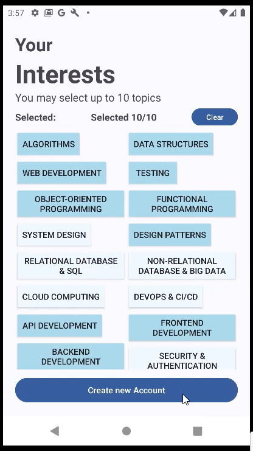
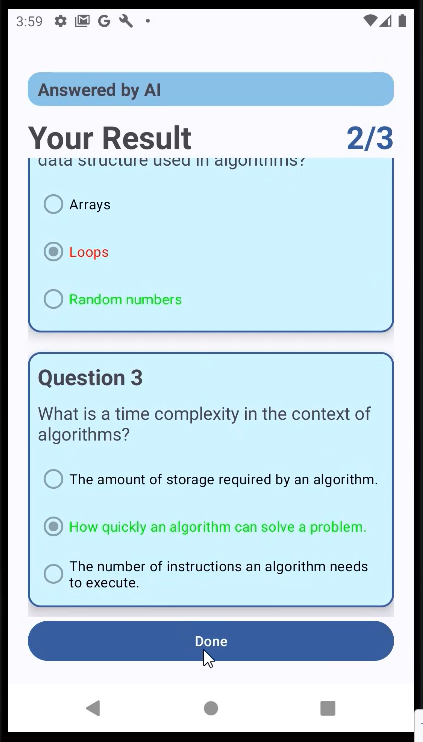

# Topic Test - Android Application
A personalized learning Android app that helps users review and improve their knowledge through AI-generated, topic-based quizzes.

<div>




</div>

## About

### Features
- **User Registration with Interests**: During account setup, users can select up to 10 areas of interest (e.g., algorithms, data structures). This information personalizes the learning content and quiz generation process.
- **Authentication System**: The login/logout feature ensures each user’s data and progress is isolated and accessible only to them.
- **AI-Generated Quizzes**: Based on selected topics, quizzes are dynamically generated through LLM-powered backends. These quizzes test users' understanding and provide immediate result.
- **Quiz Result Analysis**: Upon completion, users can view total scores and correct answers.
- **Learning History and Achievements**: Completed quizzes are stored in the user’s history. The profile page displays learning achievements such as AI-generated summary, total questions attempted and correctly answered.

### Development
During development, the code is stored in my university study GitHub account at [repo](https://github.com/alice-tat/Task10_1D_ImprovedPersonalizedLearningExperiencesApp).

Android Application (This repo):
- Android Studio: Meerkat | 2024.3.1
- Android SDK: Android 13.0 ("Tiramisu") 33-ext4

Backend API server at [TUT888/TopicTest-BackendAPI](https://github.com/TUT888/TopicTest-BackendAPI):
- Python Flask
- HuggingFace API
- MongoDB (MongoDB Atlas)

## How to run
1. Clone and run the backend API repo
2. Clone this repo
3. Update the IP address
    - `MainActivity.java`: change the value of `BACKEND_URL` variable (**app/src/main/java/deakin/sit/improvedpersonalizedlearningexperiencesapp/MainActivity.java**)
    - `network_security_config.xml`: change the IP value inside the `domain` element (**app/src/main/res/xml/network_security_config.xml**)
4. Run the app

## Project Structure

### Java source code
```bash
├── account
│   ├── util
│   │   └── PaymentsUtil.java
│   ├── viewmodel
│   │   └── CheckoutViewModel.java
│   └── AccountMenuFragment.java
│   └── AccountProfileFragment.java
│   └── AccountTaskHistoryFragment.java
│   └── AccountViewActivity.java
│   └── CheckoutActivity.java
│   └── Constants.java
├── database
│   └── Student.java
│   └── StudentInterest.java
│   └── StudentTask.java
│   └── StudentTaskQuestion.java
├── home
│   ├── HomeActivity.java
│   └── StudentTaskAdapter.java
├── signup
│   ├── InterestAdapter.java
│   ├── SignupActivity.java
│   ├── SignupPersonalDetailFragment.java
│   └── SignupPersonalInterestFragment.java
├── task
│   ├── QuestionAdapter.java
│   ├── TaskActivity.java
│   ├── TaskQuestionFragment.java
│   └── TaskResultFragment.java
└── MainActivity.java
```

### Resources
```bash
├── color
│   └── interest_selector.xml
├── drawable
│   ├── loading_background.xml
│   ├── progress_background.xml
│   ├── notification_background.
│   ├── task_block_background.xml
│   └── user.png
├── layout
│   ├── activity_account_view.xml
│   ├── activity_checkout.xml
│   ├── activity_home.xml
│   ├── activity_main.xml
│   ├── activity_signup.xml
│   ├── activity_task.xml
│   ├── fragment_account_menu.xml 
│   ├── fragment_account_profile.xml
│   ├── fragment_account_task_history.xml
│   ├── fragment_signup_personal_detail.xml
│   ├── fragment_signup_personal_interest.xml
│   ├── fragment_task_question.xml
│   ├── fragment_task_result.xml
│   ├── interest_row.xml
│   ├── question_row.xml
│   └── task_row.xml
├── values
│   ├── colors.xml
│   └── ...
└── values
    ├── network_security_config.xml
    └── ...
```

## Reference
Model and inference used in project
- LLM model: [google/gemma-2-2b-it](https://huggingface.co/google/gemma-2-2b-it)
- Nebius provider: [Nebius AI Studio Documentation](https://docs.nebius.com/studio/api/examples)
- Color reference [Scheme Color - Shiny Light Blue Color Scheme](https://www.schemecolor.com/shiny-light-blue.php)

Other:
- About inference provider: [Inference Provider](https://huggingface.co/docs/inference-providers/en/index)
- Search model by inference provider: [Hugging Face - Inference Providers](https://huggingface.co/models?other=conversational&sort=likes)
